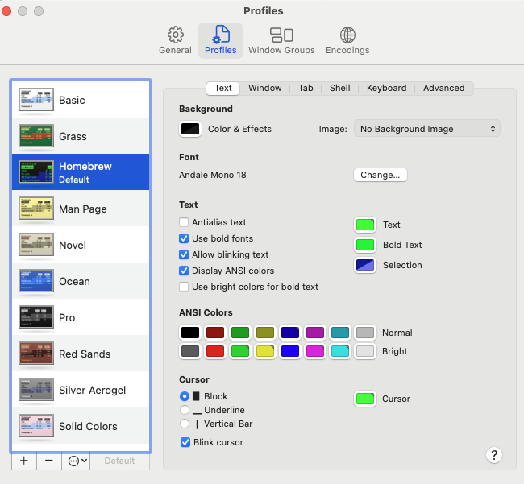
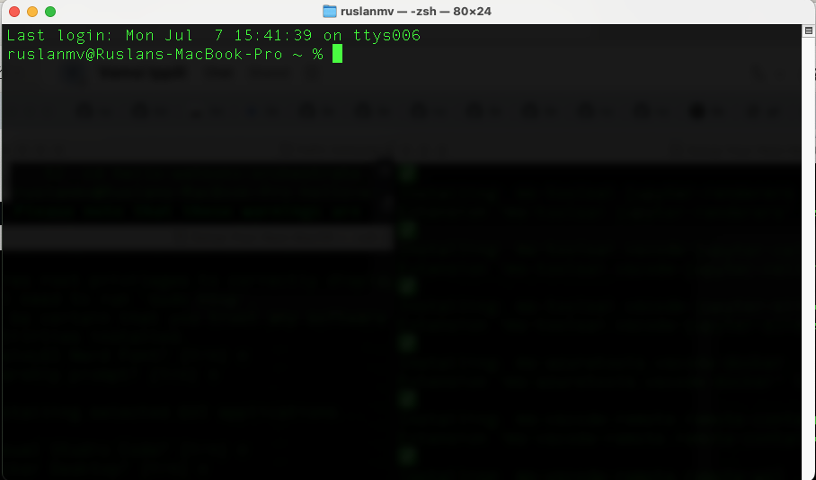
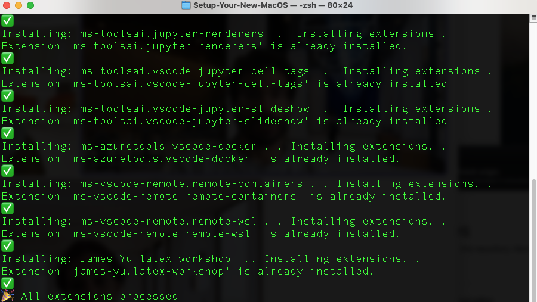

# Set Up Your New macOS from Zero

Getting a new Mac ready for development can feel like a chore. This guide streamlines the process, taking you from a fresh macOS installation to a fully-equipped development environment. We'll use Homebrew to manage our packages, set up essential runtimes like Python and Node.js, and install powerful tools like VS Code and a suite of productivity-boosting applications.


T he first step is give a Good looking  appareance of our Terminal in Unix.

1. **Open Terminal Preferences**

   * Launch Terminal (⌘ Space → type “Terminal” → ↵).
   * From the menu bar, choose **Terminal → Preferences…** (or press ⌘ ,).

2. **Select the “Homebrew” Profile**

   * In the Preferences window, click the **Profiles** tab (in older macOS versions this may be called “Settings”).
   * In the list on the left, scroll down and click **Homebrew**.

3. **Set Andale Mono, 18 pt**

   * With **Homebrew** highlighted, look in the right-hand pane under **Text**.
   * Next to **Font**, click the **Change…** button.
   * In the font picker that appears:

     1. Choose **Andale Mono** from the font list.
     2. Set the size to **18**.
     3. Click **OK** (or **Done**).

4. **Make Homebrew the Default Profile**

   * At the bottom of the Profiles list (left side), click the **Default** button.

     > This tells Terminal to use **Homebrew** (with your newly chosen font) for all future windows and tabs.



5. **Close Preferences**

   * Simply close the Preferences window. From now on, every new Terminal session (window or tab) will open with the Homebrew color scheme and Andale Mono 18 pt font.

> **Note:** These steps only change the appearance settings (“profiles”)—they do not alter any shell behavior or commands.

and now when you open your terminal you will have the appropiate terminal colors 


**Quick Install (Copy & Paste)**

For the impatient, here’s the one-liner to bootstrap Homebrew. But read on for important details and post-install steps to get everything running smoothly.

```bash
/bin/bash -c "$(curl -fsSL https://raw.githubusercontent.com/Homebrew/install/HEAD/install.sh)"
```

---

## Is Homebrew Installed?

After running the script, verify that `brew` is available in your terminal:

```bash
brew
```

* If you see `zsh: command not found: brew`, Homebrew didn’t install correctly.
* If you already have Homebrew but it’s broken, you may need to uninstall and reinstall. Make sure there are no Homebrew files under `/usr/local/bin` (for Intel Macs) or `/opt/homebrew` (for Apple Silicon Macs):

  ```bash
  ls /opt/homebrew
  ```

  If that reports “No such file or directory,” you’re clear to proceed with the installer command above.

---

## Installing Xcode Command-Line Tools

Homebrew depends on Apple’s Command-Line Tools, which provide `git`, compilers, and system headers. If you haven’t installed them before, run:

```bash
xcode-select --install
```

A system dialog will appear, prompting you to install the tools. Press **Install**, wait a few minutes for the download and installation to complete, and then confirm it's correctly installed:

```bash
xcode-select -p
# → should print /Library/Developer/CommandLineTools
```

---

## Adding Homebrew to Your PATH

On Apple Silicon Macs, Homebrew installs into a directory (`/opt/homebrew`) that isn’t on your shell’s default `$PATH`. The installer will print instructions to add it. You need to run these two lines:

```bash
(echo; echo 'eval "$(/opt/homebrew/bin/brew shellenv)"') >> ~/.zprofile
eval "$(/opt/homebrew/bin/brew shellenv)"
```

This adds the necessary command to your shell's profile and then evaluates it for the current session. To ensure it loads automatically in new terminal windows, reload your shell:

```bash
exec $SHELL
```

Now, `brew --version` should return something like `Homebrew 4.x.x`.

---

## Core Package Installation

With Homebrew live, you can install the most-used development runtimes and tools.

1. **Python 3.12**

   ```bash
   brew install python@3.12
   brew link --overwrite --force python@3.12
   python3 --version   # → Python 3.12.x
   pip3 --version
   ```

2. **Node.js 20 (via nvm)**
   We use `nvm` (Node Version Manager) to handle different Node.js versions gracefully.

   ```bash
   brew install nvm
   mkdir -p ~/.nvm
   echo 'export NVM_DIR="$HOME/.nvm"' >> ~/.zprofile
   echo '[ -s "$(brew --prefix nvm)/nvm.sh" ] && . "$(brew --prefix nvm)/nvm.sh"' >> ~/.zprofile
   exec $SHELL
   nvm install 20
   nvm alias default 20
   node -v             # → v20.x.x
   npm -v              # → 10.x.x or later
   ```

3. **Git**
   While macOS comes with Git, the Homebrew version is typically more up-to-date.

   ```bash
   brew install git
   git --version       # → git version 2.xx.x
   ```

4. **Handy Unix Utilities**
   These are small but mighty tools you'll be glad to have.

   ```bash
   brew install dos2unix wget htop tree jq
   ```

---

## Configure Your Terminal

You can use the built-in Terminal or install [iTerm2](https://www.iterm2.com/) for more features. To modernize your prompt and make it more informative:

1. **Install a Nerd Font** (e.g., MesloLGS NF) for powerline symbols and icons:

   ```bash
   brew tap homebrew/cask-fonts
   brew install --cask font-meslo-lg-nerd-font
   ```

   After installation, open your Terminal/iTerm2 preferences and set **MesloLGS NF** as your font.

2. **Install Starship** for a blazing-fast, highly customizable prompt:

   ```bash
   brew install starship
   echo 'eval "$(starship init zsh)"' >> ~/.zshrc
   exec $SHELL
   ```

   Your terminal prompt will now be more informative, showing Git status, programming language versions, and more.

---

## Install & Configure VS Code

1. **Install VS Code**

   ```bash
   brew install --cask visual-studio-code
   ```

   Launch it once from your Applications folder so macOS can complete its initial security verification.

2. **Add the `code` Helper**
   In VS Code, press **⇧⌘P**, search for *Shell Command: Install 'code' command in PATH*, and hit Enter. This lets you open files and projects from your terminal. Then restart your terminal and confirm:

   ```bash
   which code
   # → /usr/local/bin/code or /opt/homebrew/bin/code
   ```

3. **Open Projects from Terminal**

   ```bash
   cd ~/your/project
   code .
   ```

4. **Essential Extensions**

   * **Python** (`ms-python.python`) for IntelliSense, debugging, and Jupyter support
   * **Docker** (`ms-azuretools.vscode-docker`) for managing container workflows
   * **GitLens** (`eamodio.gitlens`) for supercharging the built-in Git capabilities
   * **Prettier – Code formatter** (`esbenp.prettier-vscode`) for consistent code style
     Install these from the Extensions view (**⇧⌘X**) in VS Code.

---

## Step 5 – Exporting & Installing Extensions (Optional)

To keep your VS Code extensions synchronized between machines:

1. **Export Extensions from Your Old Setup**

   ```bash
   code --list-extensions > extensions.txt
   ```

2. **Use your existing** [`install_extensions.sh`](https://github.com/ruslanmv/Setup-Your-New-MacOS/blob/main/install_extensions.sh) 
   You should already have an `install_extensions.sh` script in your home or project directory. If not, create it with the following content:


This will install every extension listed in `extensions.txt`, skipping blank lines and comments, and show you a success or failure indicator for each.


---

## Python Virtual Environments

Always isolate your project dependencies to avoid conflicts.

1. **Create** a `.venv` folder in your project directory:

   ```bash
   python3 -m venv .venv
   ```

2. **Activate** the environment:

   ```bash
   source .venv/bin/activate
   ```

   Your shell prompt will change to indicate you're inside the virtual environment.

3. **Install** necessary tools within the environment:

   ```bash
   pip install ipykernel black flake8
   ```

4. In VS Code, select the correct interpreter. Press **⇧⌘P** → *Python: Select Interpreter* → choose the one located in your project’s `.venv` folder.

When you’re done, run `deactivate` to exit the virtual environment.

---

## 🚀 Essential Mac Apps for Developers

Beyond the command line, a few GUI applications can dramatically improve your workflow. We can install these easily with Homebrew Cask.

* **Docker Desktop** for containerized development

  ```bash
  brew install --cask docker
  ```
* **Rectangle** for window management shortcuts

  ```bash
  brew install --cask rectangle
  ```
* **Raycast** as a Spotlight replacement and launcher

  ```bash
  brew install --cask raycast
  ```
* **Insomnia** for API design, testing, and debugging

  ```bash
  brew install --cask insomnia
  ```
* **Maccy** as a lightweight clipboard manager

  ```bash
  brew install --cask maccy
  ```

---

## Verification & Troubleshooting

* **Check brew health**

  ```bash
  brew doctor
  # → “Your system is ready to brew.”
  ```
* **Missing `brew` on Apple Silicon?**
  Ensure your `~/.zprofile` contains the `eval "$(/opt/homebrew/bin/brew shellenv)"` line and restart your terminal.
* **Command not found: code**
  Re-run the *Shell Command: Install 'code'* step inside VS Code, then restart your shell.

---


Here there is a single, self-contained Bash script—[**install.sh**](https://github.com/ruslanmv/Setup-Your-New-MacOS/blob/main/install.sh) that will walk you through every step interactively. Just download it, make it executable, and run it.

You’re now fully equipped with a modern macOS 14.4 development setup. You have Homebrew-managed runtimes, a powerful zsh prompt, VS Code integrated with your shell, isolated Python environments, and a suite of best-in-class GUI tools. Happy coding!
